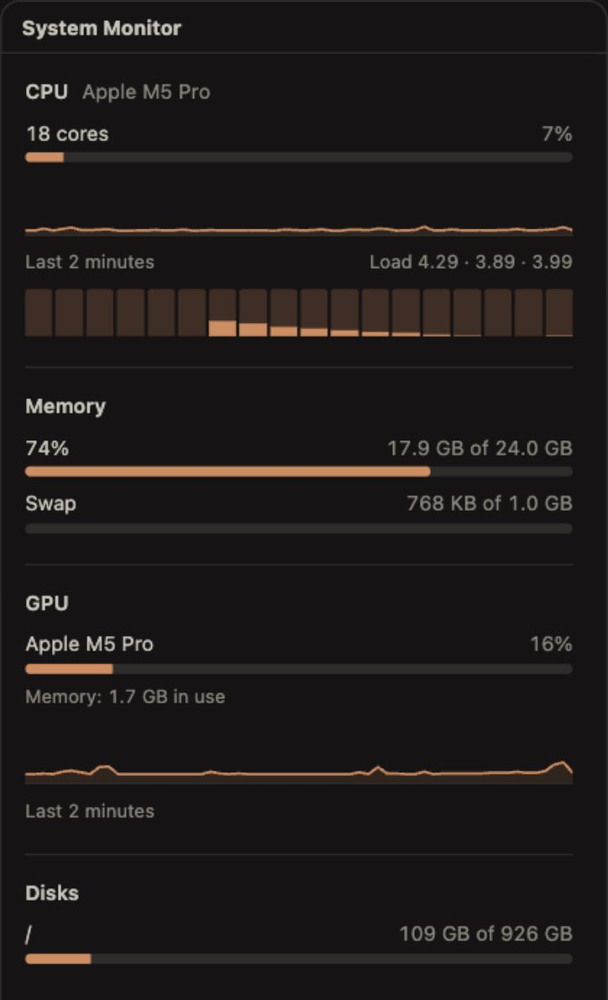
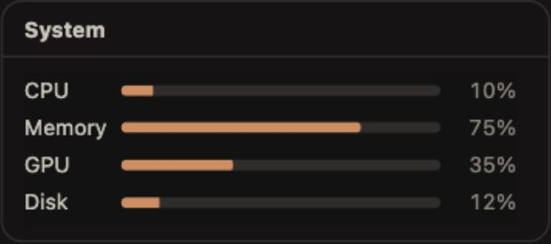

# System Monitor for OpenChamber

An [OpenChamber](https://github.com/openchamber/openchamber) extension that shows how busy the machine running OpenChamber is: CPU, memory, GPU and disks.

<p>
  
  
</p>

- **Rail panel**: CPU overall and per core with a two-minute chart and load average, memory and swap, every GPU with utilization and memory, every disk.
- **Work Status section**: four compact bars for CPU, memory, the busiest GPU and the fullest disk.
- **Badge**: the rail icon counts active warnings, so you notice a full disk without opening anything.
- **Containers**: inside a Linux container it shows the container's CPU and memory limits, marked as *Container*.
- Follows the OpenChamber theme and language (all 13 OpenChamber locales).

## Install

You need OpenChamber 2.0.1 or newer, on desktop or web. VS Code and mobile do not load extensions.

1. Open **Settings → Extensions**.
2. Paste `https://github.com/fuchs-alexander/openchamber-system-monitor` and click **add**.
3. Allow the local service when asked (see below for why).

OpenChamber offers an **Update** button when a newer version is published here. To pin a version, add it to the URL: `…/openchamber-system-monitor#v1.0.1`.

## What it measures, and where

Everything is measured on the machine where the OpenChamber **server** runs. If you are connected to a remote server, you see that server's load.

| | macOS | Linux | Windows |
|---|---|---|---|
| CPU | `os.cpus()` | `os.cpus()`, cgroup limit in a container | `os.cpus()` |
| Load average | `os.loadavg()` | `os.loadavg()` | – (Windows has none) |
| Memory | `vm_stat` (like Activity Monitor), `sysctl vm.swapusage` | `/proc/meminfo`, cgroup limit in a container | `os.totalmem()` / `os.freemem()` |
| GPU | `ioreg` (Apple Silicon and Intel) | `nvidia-smi`, AMD via `/sys/class/drm` | `nvidia-smi`, otherwise WMI GPU performance counters |
| Disks | `df`, APFS volumes folded into their container | `df`, real filesystems only | `Win32_LogicalDisk` |

A value the system does not provide is shown as *not available*, never as 0.

## Warnings

| | Warning | Critical |
|---|---|---|
| Disk | 90 % full | 95 % full |
| Memory | 90 % used | 95 % used |
| CPU, GPU | 90 % or more for a full minute | – |

The badge on the rail icon shows how many warnings are active. OpenChamber clears it when you open the panel; it comes back when the set of warnings changes.

## Why it needs a local service

The panel runs in a sandboxed iframe that cannot read anything from the system. A small Node service in this package does the measuring. OpenChamber starts it with its own runtime, on `127.0.0.1` only, and passes the panel's requests through.

The service only reads. It runs these commands, depending on the system: `df`, `ioreg`, `vm_stat`, `sysctl`, `nvidia-smi`, `powershell`. It measures only while a panel or the status section asks (every 2 seconds) and goes idle 30 seconds after the last request.

## Known limits

- The badge updates while the Work Status panel is visible, because that section does the asking. With it closed, the badge keeps its last state.
- On Windows without an NVIDIA card, GPU memory shows as *in use* only. Windows does not report the total reliably.
- Container detection covers Linux containers (Docker, Podman, Kubernetes). Docker Desktop on macOS and Windows runs a Linux VM, so the extension inside it sees that VM.
- On Apple Silicon, GPU memory is shared with the CPU, so there is no separate total.

## Development

Needs [Bun](https://bun.sh) and Node 22+.

```bash
bun install
bun run check            # typecheck, tests, build
node scripts/smoke.mjs   # start the built service and check a real /stats answer
bun run preview          # both frames in a normal browser, with a light/dark and language switch
```

Install your working copy with **Settings → Extensions → add** and the folder path. After `bun run build`, reload the OpenChamber window. A changed service picks up the new code after OpenChamber restarts it.

`dist/` is committed so that installing from the git URL works without a build step. See [AGENTS.md](AGENTS.md) for the layout and rules.

## License

[MIT](LICENSE)
